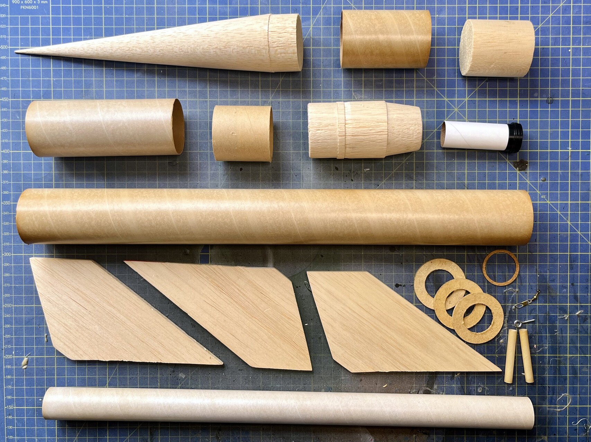

# fat-boys

These files are related to the documentation and construction of the FSI 1/8 scale Black Brant II kit.

## Kit Parts

### Original Parts

* [decals](fsi_bbii_decal.jpg)
* [fin guide](fsi_bbii_finguide.pdf)
* [assemply guide](fsi_bbii_assembly.pdf)

### Kit Designs

* 3D model of the rocket and components
  * [fusion360 model](fsi_bbii_model.f3d)
  * [STEP files](fsi_bbii_model.step)
* [Open Rocket Design](fsi_bbii.ork)
* [Scale Drawings](fsi_bbii_scale_drawings.pdf)
* [Roll pattern layout](roll-patten.png)

### Fin Alignment Jig

* [3D model](fin_aligner.3mf)
* [source](fin_aligner.scad)

### Black Brant Logo

* [SVG](goose.svg)
* [source](goose.afdesign)
